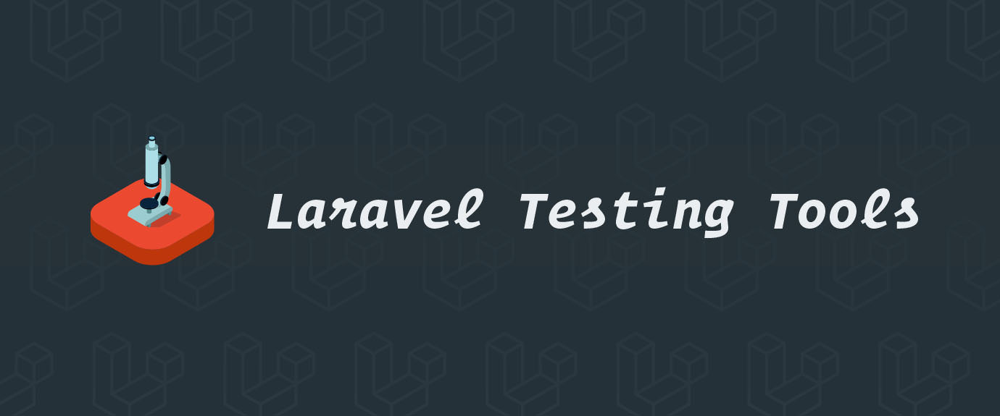

# Laravel Testing Tools

[](https://buymeacoffee.com/dmitry.ivanov)

[](https://github.styleci.io/repos/75414626?branch=9.x)
[](https://github.com/dmitry-ivanov/laravel-testing-tools/actions?query=workflow%3Atests+branch%3A9.x)
[](https://app.codecov.io/gh/dmitry-ivanov/laravel-testing-tools/branch/9.x)


Laravel-specific Testing Helpers and Assertions.

| Laravel | Testing Tools                                                            |
|---------|--------------------------------------------------------------------------|
| 9.x     | [9.x](https://github.com/dmitry-ivanov/laravel-testing-tools/tree/9.x)   |
| 8.x     | [8.x](https://github.com/dmitry-ivanov/laravel-testing-tools/tree/8.x)   |
| 7.x     | [7.x](https://github.com/dmitry-ivanov/laravel-testing-tools/tree/7.x)   |
| 6.x     | [6.x](https://github.com/dmitry-ivanov/laravel-testing-tools/tree/6.x)   |
| 5.8.*   | [5.8.*](https://github.com/dmitry-ivanov/laravel-testing-tools/tree/5.8) |
| 5.7.*   | [5.7.*](https://github.com/dmitry-ivanov/laravel-testing-tools/tree/5.7) |
| 5.6.*   | [5.6.*](https://github.com/dmitry-ivanov/laravel-testing-tools/tree/5.6) |
| 5.5.*   | [5.5.*](https://github.com/dmitry-ivanov/laravel-testing-tools/tree/5.5) |
| 5.4.*   | [5.4.*](https://github.com/dmitry-ivanov/laravel-testing-tools/tree/5.4) |
| 5.3.*   | [5.3.*](https://github.com/dmitry-ivanov/laravel-testing-tools/tree/5.3) |
| 5.2.*   | [5.2.*](https://github.com/dmitry-ivanov/laravel-testing-tools/tree/5.2) |
| 5.1.*   | [5.1.*](https://github.com/dmitry-ivanov/laravel-testing-tools/tree/5.1) |

## Usage

1. Install the package via Composer:

    ```shell script
    composer require --dev "illuminated/testing-tools:^9.0"
    ```

2. Use `Illuminated\Testing\TestingTools` trait:

    ```php
    use Illuminated\Testing\TestingTools;

    abstract class TestCase extends Illuminate\Foundation\Testing\TestCase
    {
        use TestingTools;

        // ...
    }
    ```

3. Use any of the provided helpers and assertions in your tests:

    ```php
    class ExampleCommandTest extends TestCase
    {
        /** @test */
        public function it_logs_hello_world()
        {
            $this->artisan('example');

            $this->seeInLogFile('example.log', 'Hello World!');
        }
    }
    ```

## Available helpers

> Feel free to contribute.

- [ApplicationHelpers](#applicationhelpers)
  - [emulateLocal](#emulatelocal)
  - [emulateProduction](#emulateproduction)
  - [emulateEnvironment](#emulateenvironment)

## Available assertions

> Feel free to contribute.

- [CollectionAsserts](#collectionasserts)
  - [assertCollectionsEqual](#assertcollectionsequal)
  - [assertCollectionsNotEqual](#assertcollectionsnotequal)
- [DatabaseAsserts](#databaseasserts)
  - [assertDatabaseHasTable](#assertdatabasehastable)
  - [assertDatabaseMissingTable](#assertdatabasemissingtable)
  - [assertDatabaseHasMany](#assertdatabasehasmany)
  - [assertDatabaseMissingMany](#assertdatabasemissingmany)
- [ExceptionAsserts](#exceptionasserts)
  - [willSeeException](#willseeexception)
- [FilesystemAsserts](#filesystemasserts)
  - [assertDirectoryEmpty](#assertdirectoryempty)
  - [assertDirectoryNotEmpty](#assertdirectorynotempty)
  - [assertFilesCount](#assertfilescount)
  - [assertNotFilesCount](#assertnotfilescount)
- [LogFileAsserts](#logfileasserts)
  - [seeLogFile](#seelogfile)
  - [dontSeeLogFile](#dontseelogfile)
  - [seeInLogFile](#seeinlogfile)
  - [dontSeeInLogFile](#dontseeinlogfile)
- [ReflectionAsserts](#reflectionasserts)
  - [assertSubclassOf](#assertsubclassof)
  - [assertNotSubclassOf](#assertnotsubclassof)
  - [assertTraitUsed](#asserttraitused)
  - [assertTraitNotUsed](#asserttraitnotused)
  - [assertMethodExists](#assertmethodexists)
  - [assertMethodNotExists](#assertmethodnotexists)
- [ScheduleAsserts](#scheduleasserts)
  - [seeScheduleCount](#seeschedulecount)
  - [dontSeeScheduleCount](#dontseeschedulecount)
  - [seeInSchedule](#seeinschedule)
  - [dontSeeInSchedule](#dontseeinschedule)
- [ServiceProviderAsserts](#serviceproviderasserts)
  - [seeRegisteredAlias](#seeregisteredalias)
  - [dontSeeRegisteredAlias](#dontseeregisteredalias)
  - [seeRegisteredCommand](#seeregisteredcommand)
  - [dontSeeRegisteredCommand](#dontseeregisteredcommand)

## Helpers

### ApplicationHelpers

#### `emulateLocal()`

Emulate that application is running on the `local` environment:

```php
$this->emulateLocal();
```

#### `emulateProduction()`

Emulate that application is running on the `production` environment:

```php
$this->emulateProduction();
```

#### `emulateEnvironment()`

Emulate that application is running on the given environment:

```php
$this->emulateEnvironment('demo');
```

## Assertions

### CollectionAsserts

#### `assertCollectionsEqual()`

Assert that the given collections are equal based on the specified key:

```php
$this->assertCollectionsEqual($collection1, $collection2, 'id');
```

#### `assertCollectionsNotEqual()`

Assert that the given collections are not equal based on the specified key:

```php
$this->assertCollectionsNotEqual($collection1, $collection2, 'id');
```

### DatabaseAsserts

#### `assertDatabaseHasTable()`

Assert that the database has the given table:

```php
$this->assertDatabaseHasTable('users');
```

#### `assertDatabaseMissingTable()`

Assert that the database doesn't have the given table:

```php
$this->assertDatabaseMissingTable('unicorns');
```

#### `assertDatabaseHasMany()`

Assert that the database has all the given rows:

```php
$this->assertDatabaseHasMany('posts', [
    ['title' => 'First Post'],
    ['title' => 'Second Post'],
    ['title' => 'Third Post'],
]);
```

#### `assertDatabaseMissingMany()`

Assert that the database doesn't have all the given rows:

```php
$this->assertDatabaseMissingMany('posts', [
    ['title' => 'Fourth Post'],
    ['title' => 'Fifth Post'],
]);
```

### ExceptionAsserts

#### `willSeeException()`

Add expectation that the given exception would be thrown:

```php
$this->willSeeException(RuntimeException::class, 'Oops! Houston, we have a problem!');
```

### FilesystemAsserts

#### `assertDirectoryEmpty()`

Assert that the given directory is empty:

```php
$this->assertDirectoryEmpty('./my/dir/');
```

#### `assertDirectoryNotEmpty()`

Assert that the given directory is not empty:

```php
$this->assertDirectoryNotEmpty('./my/dir/');
```

#### `assertFilesCount()`

Assert that directory has the given number of files:

```php
$this->assertFilesCount('./my/dir/', 3);
```

#### `assertNotFilesCount()`

Assert that directory doesn't have the given number of files:

```php
$this->assertNotFilesCount('./my/dir/', 5);
```

### LogFileAsserts

#### `seeLogFile()`

Assert that the given log file exists.

The path is relative to the `storage/logs` folder:

```php
$this->seeLogFile('example.log');
```

#### `dontSeeLogFile()`

Assert that the given log file doesn't exist.

The path is relative to the `storage/logs` folder:

```php
$this->dontSeeLogFile('foobarbaz.log');
```

#### `seeInLogFile()`

Assert that the log file contains the given message.

The path is relative to the `storage/logs` folder:

```php
$this->seeInLogFile('example.log', 'Sample log message!');
```

Also, you can specify an array of messages:

```php
$this->seeInLogFile('example.log', [
    'Sample log message 1!',
    'Sample log message 2!',
    'Sample log message 3!',
]);
```

You can use these placeholders in messages:
- `%datetime%` - any datetime string.

```php
$this->seeInLogFile('example.log', '[%datetime%]: Sample log message!');
```

#### `dontSeeInLogFile()`

Assert that the log file doesn't contain the given message.

The path is relative to the `storage/logs` folder:

```php
$this->dontSeeInLogFile('example.log', 'Non-existing log message!');
```

Also, you can specify an array of messages:

```php
$this->dontSeeInLogFile('example.log', [
    'Non-existing log message 1!',
    'Non-existing log message 2!',
    'Non-existing log message 3!',
]);
```

### ReflectionAsserts

#### `assertSubclassOf()`

Assert that class is a subclass of the given parent:

```php
$this->assertSubclassOf(Post::class, Model::class);
```

#### `assertNotSubclassOf()`

Assert that class is not a subclass of the given parent:

```php
$this->assertNotSubclassOf(Post::class, Command::class);
```

#### `assertTraitUsed()`

Assert that class uses the given trait:

```php
$this->assertTraitUsed(User::class, Notifiable::class);
```

#### `assertTraitNotUsed()`

Assert that class doesn't use the given trait:

```php
$this->assertTraitNotUsed(Post::class, Notifiable::class);
```

#### `assertMethodExists()`

Assert that object has the given method:

```php
$this->assertMethodExists(Post::class, 'save');
```

#### `assertMethodNotExists()`

Assert that object doesn't have the given method:

```php
$this->assertMethodNotExists(Post::class, 'fly');
```

### ScheduleAsserts

#### `seeScheduleCount()`

Assert that schedule count equals to the given value:

```php
$this->seeScheduleCount(3);
```

#### `dontSeeScheduleCount()`

Assert that schedule count doesn't equal to the given value:

```php
$this->dontSeeScheduleCount(5);
```

#### `seeInSchedule()`

Assert that the given command is scheduled:

```php
$this->seeInSchedule('foo', 'everyFiveMinutes');
$this->seeInSchedule('bar', 'hourly');
$this->seeInSchedule('baz', 'twiceDaily');
```

Also, you can use cron expressions:

```php
$this->seeInSchedule('foo', '*/5 * * * * *');
$this->seeInSchedule('bar', '0 * * * * *');
$this->seeInSchedule('baz', '0 1,13 * * * *');
```

#### `dontSeeInSchedule()`

Assert that the given command is not scheduled:

```php
$this->dontSeeInSchedule('foobarbaz');
```

### ServiceProviderAsserts

#### `seeRegisteredAlias()`

Assert that the given alias is registered:

```php
$this->seeRegisteredAlias('Twitter');
```

#### `dontSeeRegisteredAlias()`

Assert that the given alias is not registered:

```php
$this->dontSeeRegisteredAlias('FooBarBaz');
```

#### `seeRegisteredCommand()`

Assert that the given command is registered:

```php
$this->seeRegisteredCommand('my-command');
```

#### `dontSeeRegisteredCommand()`

Assert that the given command is not registered:

```php
$this->dontSeeRegisteredCommand('foobarbaz');
```

## Sponsors

[](https://laravel-idea.com)<br>
[](https://material-theme.com)<br>

## License

Laravel Testing Tools is open-sourced software licensed under the [MIT license](LICENSE.md).

[](https://patreon.com/dmitryivanov)
